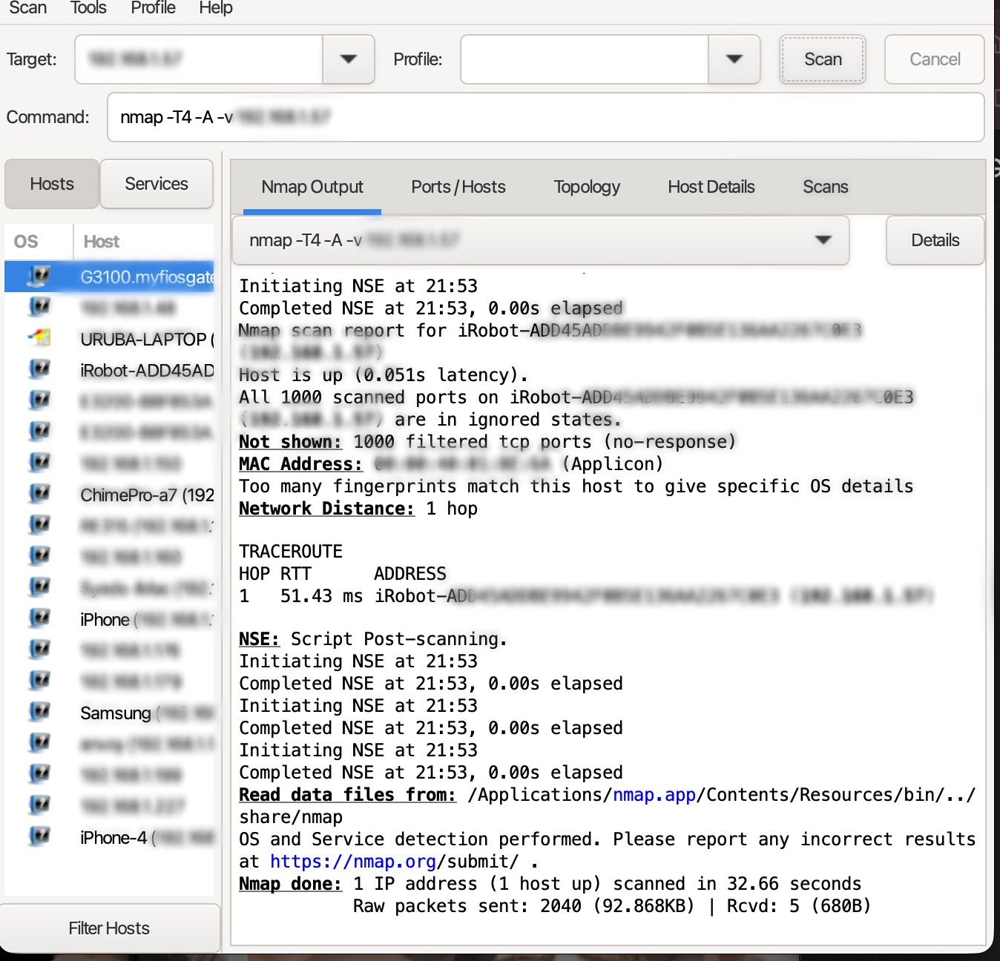
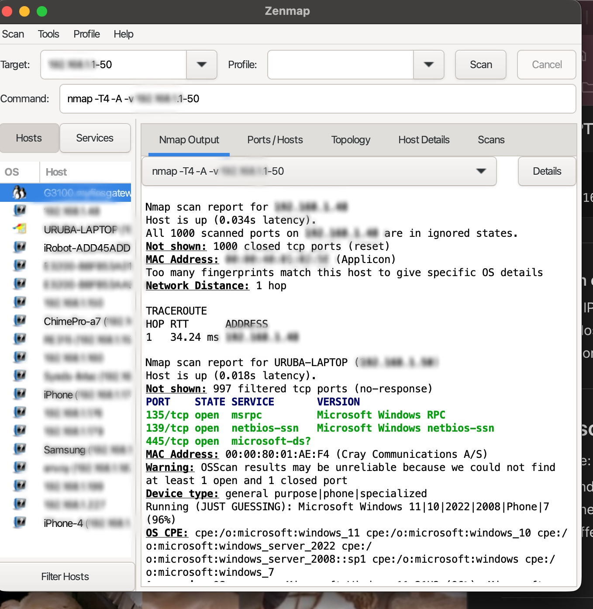
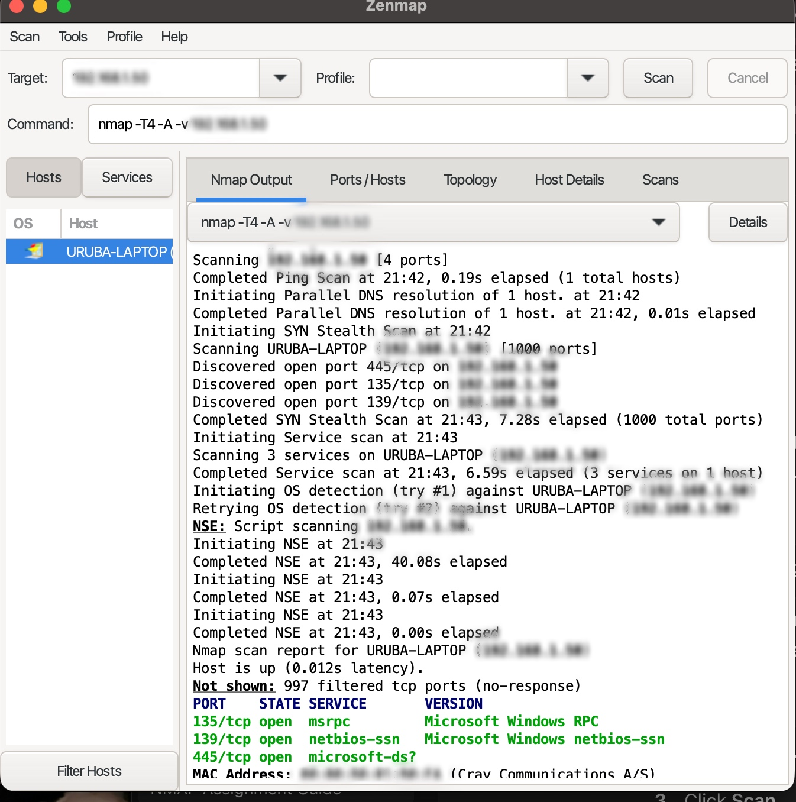

# Nmap Network Scanning Project

## Introduction
This project demonstrates the use of Nmap and Zenmap for network discovery and vulnerability analysis within a local network. The goal was to identify active hosts, analyze open ports, and gather system and service information using different scan techniques.

---

## Scan 1: Network Discovery Scan

**Command Used:**
nmap -sn 192.168.1.0/24

**Explanation:**  
This scan was used to identify all active devices on the local network without performing port scanning. The `-sn` flag performs a ping scan, which helps quickly discover hosts that are up. The results show multiple devices including routers, laptops, mobile devices, and IoT devices, along with their IP and MAC addresses.

---

## Scan 2: Single Host Detailed Scan (iRobot Device)

**Command Used:**
nmap -T4 -A -v 192.168.1.57

**Explanation:**  
This scan targeted a specific host on the network and used aggressive scanning options. The `-A` flag enables OS detection, version detection, script scanning, and traceroute. The results show that all ports are filtered, meaning the device is likely protected by a firewall or does not respond to probes. This is common for IoT devices that restrict network visibility for security reasons.

---

## Scan 3: Range Scan (Multiple Hosts)

**Command Used:**
nmap -T4 -A -v 192.168.1.1-50

**Explanation:**  
This scan was performed on a range of IP addresses to analyze multiple devices at once. It identifies active hosts, scans for open ports, and attempts OS detection. One notable result is the detection of a Windows machine with open ports such as 135, 139, and 445, which are commonly associated with SMB and Windows networking services.

---

## Scan 4: Detailed Scan with Open Ports (Local Machine)

**Command Used:**
nmap -T4 -A -v 192.168.1.50

**Explanation:**  
This scan focused on a single machine and revealed multiple open ports. Ports 135 (RPC), 139 (NetBIOS), and 445 (SMB) were identified as open, indicating active Windows networking services. These ports are commonly used for file sharing and remote procedure calls, but they can also present security risks if not properly secured.

---

## Conclusion
This project demonstrates how Nmap can be used to discover devices, analyze network services, and identify potential security risks within a local network. Understanding these scan results is essential for both network troubleshooting and cybersecurity analysis.
